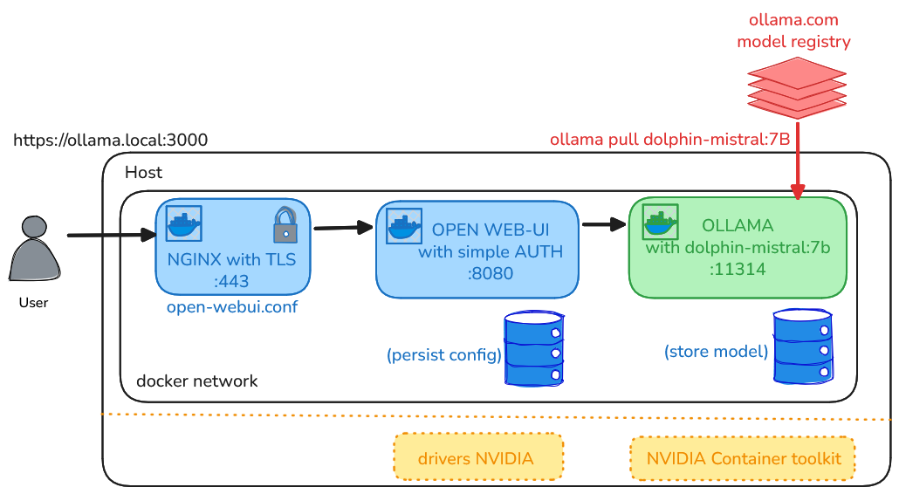

# lancement local de Ollama

## :mag_right: petite introduction à Ollama

* **GPT**: Generative Pre-trained **Transformer**
  + algorithme général de deep learning communément utilisé par les LLMs

* **LLM**: Large Language Model
  + modèle de langage basé sur l'architecture Transformer
  + entraîné sur un grand corpus de texte pour générer du texte cohérent et contextuellement pertinent

* **chatGPT**: client (chat) + llm créé par *OPENAI*

* **LLama** = LLM de *Meta*

* OLLama = *Open* LLama =  un portail public hébergeant des modèles open-source et/ou gratuit à installer

## :mag_right: Schéma de la pile de services



## :mag_right: paramètrer un modèle avec ollama

* [ici](./glossaire-parametres-ollama.md)


## crash course de Docker


Docker est une plateforme permettant de créer, déployer et exécuter des applications dans des conteneurs. Un conteneur est une unité standardisée qui contient tout le nécessaire pour exécuter une application : code, runtime, bibliothèques et dépendances.

* ex lancement d'un postgresql


```bash
# -d: détaché (en arrière-plan)
# -e: variable d'environnement pour configurer
# -p: port mapping entre l'hôte et le conteneur
# --name: nom du conteneur
# --restart unless-stopped: redémarrage automatique sauf si le conteneur est arrêté manuellement
# -v: volume pour persister les données du conteneur sur l'hôte quand le conteneur est supprimé
# postgres:15-trixie: image officielle de PostgreSQL version 15 avec la variante "trixie"
docker run \
       -d \
       --name postgres \
       --restart unless-stopped \
       -e POSTGRES_PASSWORD=roottoor \
       -p 5432:5432 \
       -v pgdata:/var/lib/postgresql/data \
       postgres:15-trixie
```

* lancement "oneshot" d'un conteneur client


```bash
# --rm: supprime le conteneur après exécution
# -it: mode interactif avec terminal (ajout du flux d'entrée et sortie)
# `psql ...` : commande custom pour utiliser des éléments contenus dans l'image
# 172.17.0.2: adresse IP du conteneur PostgreSQL (à adapter selon votre configuration)
# le réseau 172.17.0.0/16 est le réseau bridge par défaut de Docker sur lequel les conteneurs sont connectés par défaut (voir docker inspect <ctn> et docker network ls)
docker run \
       --name client \
       --rm \
       -it postgres:15-trixie psql -h 172.17.0.2 -U postgres --password
```
